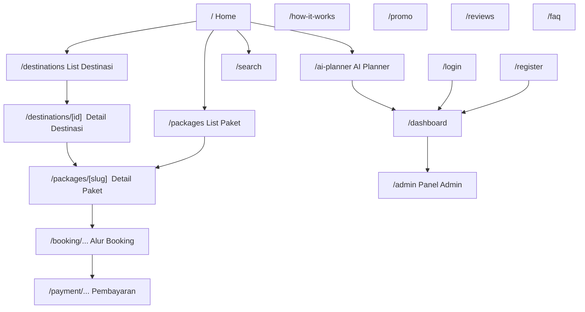
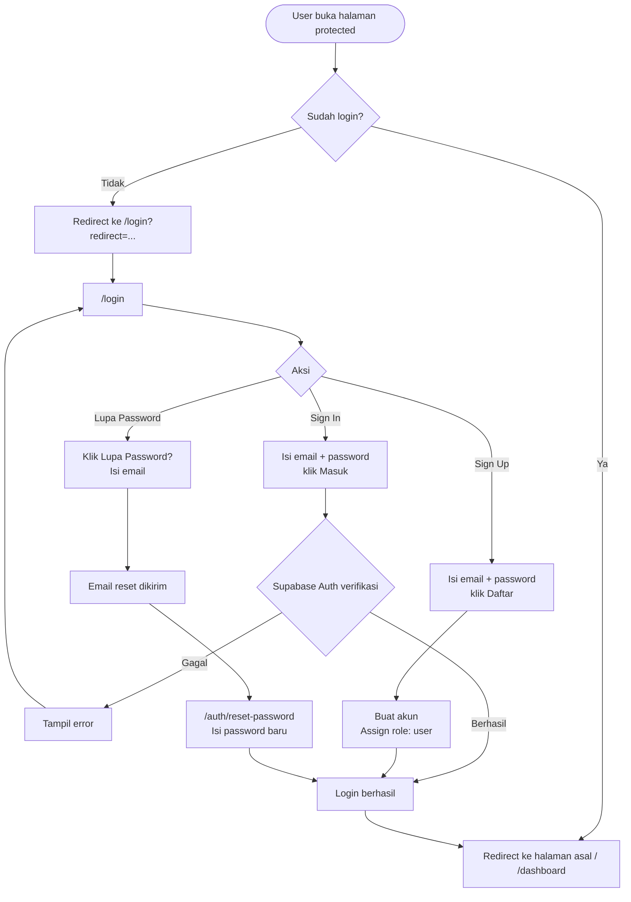
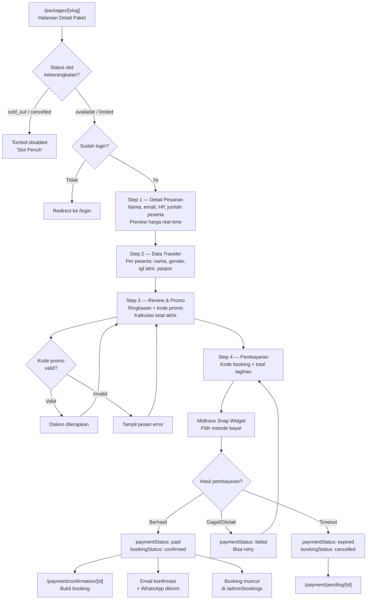
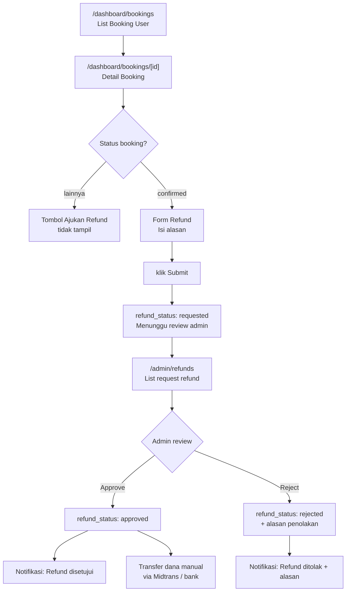
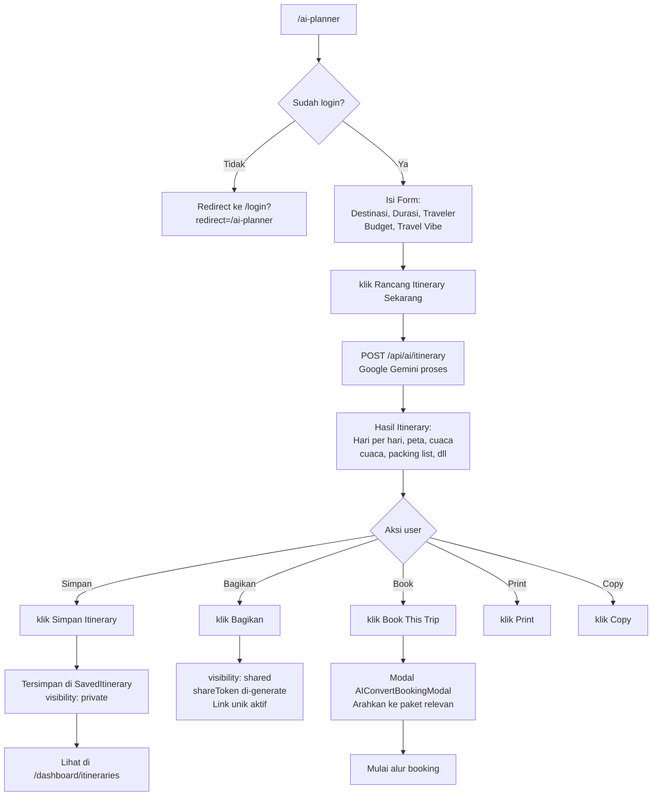
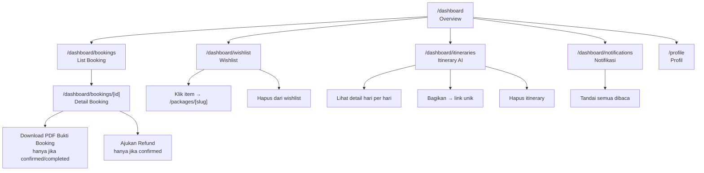
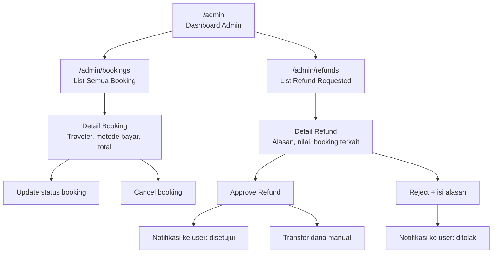
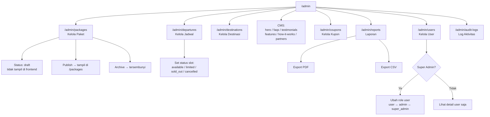

# NOVA — Diagram Alur (Flow)

> Semua diagram menggunakan Mermaid. Render di GitHub, Notion, atau https://mermaid.live

---

## 1. Alur Navigasi Utama (Sitemap)

---

## 2. Alur Autentikasi

---

## 3. Alur Booking End-to-End

---

## 4. Alur Refund End-to-End

---

## 5. Alur AI Planner

---

## 6. Alur Dashboard User

---

## 7. Alur Admin — Kelola Booking & Refund

---

## 8. Alur Admin — Kelola Konten & Paket

---

## 9. Matriks Akses per Role

```mermaid
flowchart LR
    subgraph USER["Role: user (Customer)"]
        U1[Browse & search]
        U2[Booking & payment]
        U3[Wishlist]
        U4[AI Planner]
        U5[Dashboard pribadi]
        U6[Ajukan refund]
    end

    subgraph OFFICER["Role: booking_officer (Staff Ops)"]
        O1[Cek & verifikasi booking]
        O2[Review & proses refund]
        O3[Lihat laporan transaksi]
        O4[Akses terbatas /admin]
    end

    subgraph ADMIN["Role: admin (Content & Ops)"]
        A1[Semua akses booking officer]
        A2[Kelola paket & jadwal]
        A3[Kelola destinasi]
        A4[Kelola CMS hero & FAQ]
        A5[Buat kupon promo]
        A6[Export laporan keuangan]
    end

    subgraph SUPER["Role: super_admin (Super Admin)"]
        S1[Semua akses admin]
        S2["Kelola akun & ubah role\n(EKSKLUSIF)"]
        S3[Audit logs & setting sistem]
    end

    USER -.-> OFFICER
    OFFICER --> ADMIN
    ADMIN --> SUPER
```

