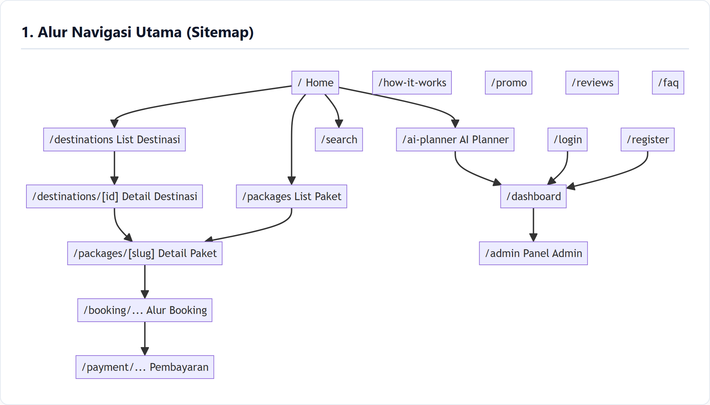
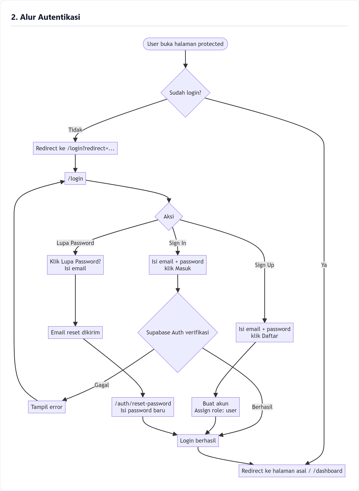
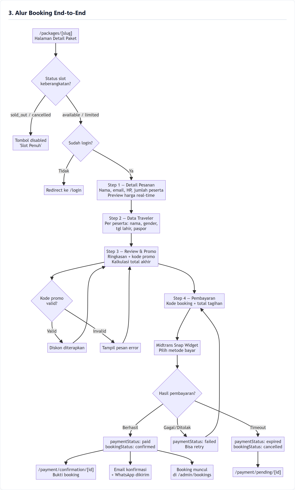
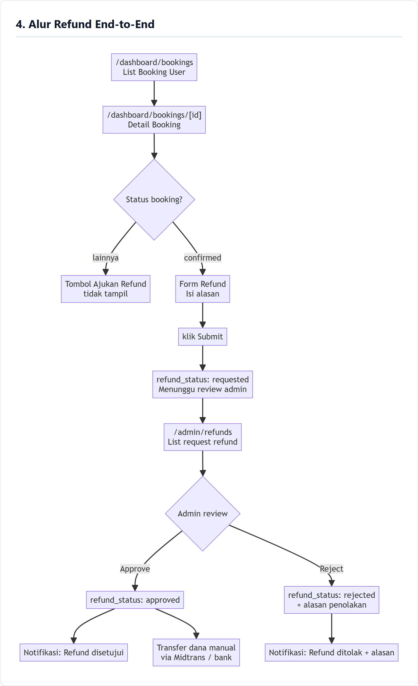
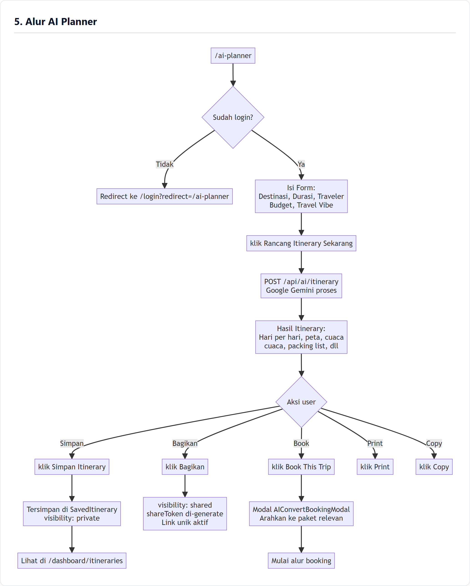
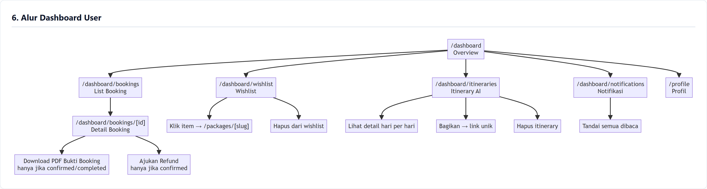
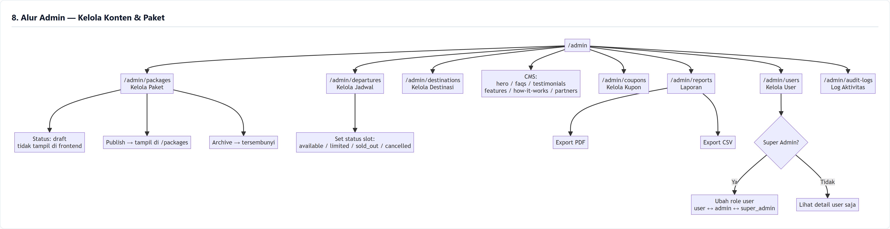
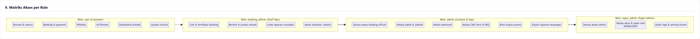

# NOVA — Panduan Alur Penggunaan Sistem (Step-by-Step Flow Guide)

> **Platform**: NOVA Travel & Tour Platform  
> **Format**: Narasi Panduan Langkah demi Langkah (Aksi Pengguna, Tombol, Form, & Efek Admin)  
> **Versi Dokumen**: 2.0 (Agustus 2026)

---

## Daftar Alur Panduan
1. [Alur Menjelajah & Mencari Paket Perjalanan](#1-alur-menjelajah--mencari-paket-perjalanan)
2. [Alur Pendaftaran Akun, Masuk, & Lupa Password](#2-alur-pendaftaran-akun-masuk--lupa-password)
3. [Alur Pemesanan (Booking) & Pembayaran Paket Langkah demi Langkah](#3-alur-pemesanan-booking--pembayaran-paket-langkah-demi-langkah)
4. [Alur Pengajuan & Persetujuan Refund (User & Admin)](#4-alur-pengajuan--persetujuan-refund-user--admin)
5. [Alur Menggunakan AI Travel Planner & Konversi ke Booking](#5-alur-menggunakan-ai-travel-planner--konversi-ke-booking)
6. [Alur Penggunaan Dashboard Mandiri Pengguna (User Dashboard)](#6-alur-penggunaan-dashboard-mandiri-pengguna-user-dashboard)
7. [Alur Operasional Admin: Kelola Paket, Jadwal, & Konten Platform](#7-alur-operasional-admin-kelola-paket-jadwal--konten-platform)
8. [Pembagian Hak Akses Role (RBAC) & Wewenang Akun](#8-pembagian-hak-akses-role-rbac--wewenang-akun)

---

## 1. Alur Menjelajah & Mencari Paket Perjalanan

Ketika pertama kali membuka website NOVA di browser pada alamat beranda `/`, Anda akan disambut oleh video latar belakang sinematik. 

1. **Memulai Eksplorasi**:
   - Di bagian tengah layar beranda, Anda dapat menekan tombol **[ Explore Packages ]** untuk langsung menuju ke halaman katalog seluruh paket wisata (`/packages`), atau menekan tombol **[ AI Planner ]** jika ingin merancang rencana liburan otomatis dengan kecerdasan buatan.
   - Jika Anda menggulir layar ke bawah, Anda akan melihat kartu-kartu destinasi unggulan. Anda cukup menekan salah satu **kartu destinasi** (misalnya kartu *Jepang* atau *Swiss*) untuk masuk ke halaman detail destinasi tersebut (`/destinations/[id]`).

2. **Melihat Detail Destinasi**:
   - Di halaman detail destinasi, Anda dapat melihat galeri foto, membaca ulasan traveler lain, serta menggeser peta interaktif untuk melihat lokasi geografisnya. 
   - Di bagian bawah peta, tersedia daftar paket yang berkaitan dengan destinasi tersebut. Tekan salah satu **kartu paket** untuk mempelajari itinerary lengkapnya.
   - Jika Anda menyukai destinasi ini dan ingin menyimpannya, tekan tombol **ikon hati ❤️ [ Tambah ke Wishlist ]** (jika belum masuk, sistem akan meminta Anda masuk ke akun terlebih dahulu).

3. **Mencari Paket Spesifik via Fitur Pencarian**:
   - Anda dapat menekan tombol **[ Cari Paket ]** di bilah menu navigasi atas (navbar) kapan saja untuk membuka halaman `/search`.
   - Di kolom pencarian, ketikkan kata kunci tujuan Anda (misalnya *"Kyoto"* atau *"Gunung Bromo"*).
   - Gunakan filter dropdown untuk memilih rentang harga, durasi perjalanan, atau kategori wisata. Hasil pencarian akan diperbarui secara instan di layar tanpa perlu memuat ulang halaman. Klik kartu paket yang paling sesuai untuk melanjutkan ke proses pemesanan.

---

## 2. Alur Pendaftaran Akun, Masuk, & Lupa Password

Untuk melakukan booking, menggunakan fitur AI, atau mengelola tiket, Anda memerlukan akun NOVA.

1. **Mendaftar Akun Baru (Sign Up)**:
   - Tekan tombol **[ Masuk ]** pada navigasi kanan atas, lalu klik tautan **"Belum punya akun? Daftar sekarang"** untuk beralih ke formulir pendaftaran (`/register`).
   - Masukkan nama lengkap Anda, alamat email yang masih aktif, serta buat kata sandi yang aman minimal 6 karakter.
   - Tekan tombol **[ Buat Akun ]**. Sistem akan mendaftarkan akun Anda ke Supabase Auth, secara otomatis memberikan hak akses (*role*) sebagai `user`, dan langsung mengarahkan Anda masuk ke halaman Dashboard (`/dashboard`).

2. **Masuk ke Akun (Sign In)**:
   - Jika sudah memiliki akun, buka halaman `/login`, ketikkan alamat email dan kata sandi Anda pada formulir yang tersedia.
   - Tekan tombol **[ Masuk ]**. Jika data cocok, tombol pada navbar kanan atas akan berubah menjadi ikon avatar profil Anda dan ikon lonceng notifikasi 🔔. Jika sebelumnya Anda sedang membuka halaman pemesanan, sistem akan secara otomatis mengembalikan Anda ke halaman pemesanan tersebut.

3. **Memulihkan Kata Sandi (Forgot Password)**:
   - Jika lupa kata sandi, pada halaman login tekan tautan **"Lupa Password?"**.
   - Masukkan email terdaftar Anda, lalu tekan tombol **[ Kirim Instruksi Reset ]**.
   - Buka kotak masuk email Anda, klik tautan pemulihan yang dikirimkan. Halaman browser akan terbuka pada `/auth/reset-password`. Ketikkan kata sandi baru Anda, lalu tekan tombol **[ Simpan Password Baru ]**. Akun Anda kini siap digunakan kembali.

---

## 3. Alur Pemesanan (Booking) & Pembayaran Paket Langkah demi Langkah

Pemesanan paket tur dilakukan melalui 4 langkah wizard formulir yang jelas dan terstruktur:

1. **Memilih Jadwal & Memulai Booking**:
   - Di halaman detail paket (`/packages/[slug]`), periksa jadwal keberangkatan yang tersedia pada kotak pilihan tanggal.
   - Perhatikan label ketersediaan kuota: jika bertuliskan *Available* atau *Limited*, Anda dapat memilih jadwal tersebut. Jika bertuliskan *Sold Out*, tombol akan dinonaktifkan.
   - Klik tanggal keberangkatan yang Anda inginkan, lalu tekan tombol utama **[ Pesan Sekarang ]**. Sistem akan membawa Anda masuk ke formulir pemesanan langkah pertama.

2. **Langkah 1 — Formulir Data Kontak Pemesan**:
   - Pada tahap ini, isi nama lengkap penanggung jawab pesanan, alamat email untuk pengiriman e-ticket, serta nomor WhatsApp aktif untuk koordinasi tur.
   - Tentukan jumlah peserta perjalanan dengan menekan tombol **[ + ]** atau **[ - ]** pada kolom jumlah peserta dewasa dan anak-anak.
   - Anda akan melihat ringkasan subtotal harga di panel sebelah kanan yang bertambah secara otomatis sesuai jumlah peserta. Setelah data selesai diisi, tekan tombol **[ Lanjut ke Data Traveler ]**.

3. **Langkah 2 — Formulir Data Penumpang (Traveler Details)**:
   - Di layar ini, isi formulir data diri untuk setiap peserta (misal: Traveler 1, Traveler 2).
   - Masukkan nama lengkap sesuai identitas resmi (KTP/Paspor), pilih jenis kelamin, tanggal lahir, dan nomor paspor jika perjalanan merupakan tur internasional.
   - Setelah semua data penumpang terisi lengkap dan valid, tekan tombol **[ Lanjut ke Review Pesanan ]**.

4. **Langkah 3 — Review Pesanan & Memasukkan Kode Promo**:
   - Periksa kembali ringkasan rincian tanggal, paket, dan nama-nama penumpang yang tertera di layar.
   - Jika Anda memiliki kode kupon diskon, ketikkan kodenya pada kotak *Kode Promo* (misalnya `NOVALIBURAN`) lalu tekan tombol **[ Gunakan ]**. Sistem akan memeriksa keabsahan kupon: jika valid, potongan harga akan langsung mengurangi total tagihan Anda.
   - Centang kotak persetujuan *"Saya menyetujui syarat & ketentuan perjalanan NOVA"*, kemudian tekan tombol **[ Lanjut ke Pembayaran ]**.

5. **Langkah 4 — Membayar via Gateway Pembayaran (Midtrans Snap)**:
   - Halaman akan memunculkan nomor tagihan dan tombol **[ Bayar Sekarang ]**.
   - Begitu tombol ditekan, jendela sembulan (pop-up) resmi Midtrans Snap akan muncul di layar. Anda tinggal memilih metode pembayaran yang diinginkan (BCA / Mandiri / BNI Virtual Account, QRIS GoPay/ShopeePay, atau Kartu Kredit).
   - Lakukan transfer pembayaran sesuai petunjuk yang tertera di layar.
   - Setelah pembayaran sukses diverifikasi secara otomatis, layar akan dialihkan ke halaman konfirmasi `/payment/confirmation/[id]`. Sistem secara instan mengirimkan email tanda terima bukti pesanan ke inbox Anda, dan tombol **[ Download E-Ticket (PDF) ]** siap untuk diunduh.

---

## 4. Alur Pengajuan & Persetujuan Refund (User & Admin)

Jika terjadi kendala dan Anda berhalangan berangkat, NOVA menyediakan mekanisme pengajuan pembatalan dan pengembalian dana:

1. **Sisi Pengguna — Mengajukan Permohonan Refund**:
   - Buka menu **Dashboard** dari navbar atas, lalu klik tab **[ My Bookings ]** (`/dashboard/bookings`).
   - Pilih dan klik pesanan yang ingin dibatalkan untuk membuka halaman rincian tiket (`/dashboard/bookings/[id]`).
   - Pada pesanan yang berstatus *Confirmed*, Anda akan menemukan tombol **[ Ajukan Refund ]** di bagian bawah rincian tiket. Tekan tombol tersebut.
   - Akan muncul formulir pengajuan refund. Pilih alasan pembatalan dari menu dropdown (misal: *Alasan Kesehatan / Perubahan Jadwal Mendadak*), ketikkan penjelasan singkat, serta masukkan nomor rekening bank dan nama pemilik rekening untuk tujuan transfer dana pengembalian.
   - Tekan tombol **[ Kirim Permohonan Refund ]**. Status tiket Anda akan langsung berubah menjadi `Refund Requested (Menunggu Review Admin)`.

2. **Sisi Admin — Memeriksa & Mengambil Tindakan Refund**:
   - Petugas admin membuka panel admin di `/admin`, lalu mengklik menu **[ Refunds ]** (`/admin/refunds`).
   - Admin melihat daftar antrean pengajuan refund terbaru, lalu menekan tombol **[ Review ]** pada permohonan yang bersangkutan.
   - Admin membaca alasan pengguna dan mencocokkannya dengan ketentuan penalti refund.
   - **Jika Disetujui**: Admin menekan tombol hijau **[ Approve Refund ]**. Status pemesanan berubah menjadi `Approved`, bagian keuangan memproses pengembalian dana ke rekening pengguna, dan pengguna menerima notifikasi email persetujuan.
   - **Jika Ditolak**: Admin menekan tombol merah **[ Reject Refund ]**, mengetikkan alasan penolakan secara wajib pada kotak teks (misalnya *"Pengajuan melewati batas waktu H-3 keberangkatan"*), lalu menekan tombol **[ Konfirmasi Tolak ]**. Notifikasi penolakan beserta alasannya akan langsung terkirim ke dashboard pengguna.

---

## 5. Alur Menggunakan AI Travel Planner & Konversi ke Booking

Fitur AI Planner memudahkan Anda menyusun jadwal liburan impian tanpa perlu riset manual yang memakan waktu:

1. **Mengisi Preferensi Perjalanan**:
   - Tekan menu **[ AI Planner ✨ ]** di navbar utama. Jika belum masuk, Anda akan diminta login terlebih dahulu.
   - Pada formulir perencana, ketik destinasi tujuan Anda (misalnya *"Bali, Indonesia"* atau *"Swiss Alps"*).
   - Geser slider durasi untuk menentukan lama liburan (misal: *4 Hari*), pilih jumlah peserta (*2 Orang*), dan tentukan kategori budget (*Mid-range*).
   - Pilih satu atau lebih *Travel Vibe* dengan mencentang opsi yang Anda sukai (misal: *Nature*, *Culinary*, *Photography*).
   - Tekan tombol utama **[ Rancang Itinerary Sekarang ]**.

2. **Melihat Hasil & Berinteraksi**:
   - Dalam hitungan detik, Google Gemini AI akan menampilkan susunan rencana perjalanan lengkap per hari (*Day 1, Day 2, dst.*), rekomendasi jam aktivitas, estimasi biaya makan, tips cuaca, hingga daftar perlengkapan (*packing list*).
   - **Menyimpan**: Tekan tombol **[ Simpan Itinerary ]** agar rencana ini tersimpan permanen di menu `/dashboard/itineraries` Anda.
   - **Membagikan**: Tekan tombol **[ Bagikan Link ]** untuk membuat tautan publik unik yang bisa langsung Anda salin dan kirimkan ke teman atau keluarga via WhatsApp.
   - **Mencetak**: Tekan tombol **[ Print / Export PDF ]** untuk mencetak itinerary dalam format kertas yang rapi.

3. **Mengubah Itinerary Menjadi Pesanan Nyata**:
   - Jika Anda tertarik memesan tur resmi berdasarkan rencana tersebut, tekan tombol **[ Book This Trip ]**.
   - Jendela rekomendasi akan menampilkan paket tur resmi NOVA yang paling relevan dengan destinasi itinerary AI Anda. Tekan tombol **[ Pilih Paket Ini ]** untuk langsung diarahkan ke alur pemesanan tiket resmi.

---

## 6. Alur Penggunaan Dashboard Mandiri Pengguna (User Dashboard)

Dashboard pengguna adalah pusat kendali untuk seluruh kebutuhan perjalanan pribadi Anda:

1. **Melihat Ringkasan (Overview)**:
   - Tekan **avatar profil** di navbar atas, lalu pilih **[ Dashboard ]** (`/dashboard`). Anda akan disajikan ringkasan total perjalanan yang telah diselesaikan, pesanan aktif yang akan datang, dan jumlah paket dalam wishlist.
2. **Mengelola Tiket & Unduh Bukti Booking**:
   - Klik tab menu **[ Bookings ]**. Anda dapat memfilter tiket berdasarkan status (*Confirmed, Pending, Completed, Cancelled*).
   - Klik salah satu tiket *Confirmed*, lalu tekan tombol **[ Download PDF ]** untuk mengunduh e-ticket resmi dengan barcode yang siap ditunjukkan kepada pemandu wisata saat keberangkatan.
3. **Mengelola Wishlist**:
   - Klik tab menu **[ Wishlist ]**. Seluruh destinasi dan paket favorit yang pernah Anda beri tanda hati ❤️ akan tersusun rapi. Tekan tombol **[ Pesan Sekarang ]** pada kartu wishlist untuk langsung membeli, atau tekan tombol **[ Hapus ]** jika tidak lagi diminati.
4. **Membaca Notifikasi**:
   - Klik ikon lonceng 🔔 atau tab **[ Notifications ]** untuk melihat pembaruan status pembayaran dan konfirmasi tiket. Tekan tombol **[ Tandai Semua Telah Dibaca ]** untuk membersihkan daftar notifikasi.
5. **Mengatur Akun & Profil**:
   - Klik menu **[ Profile ]** untuk memperbarui nomor telepon, alamat, kontak darurat, atau mengganti kata sandi lama Anda dengan menekan tombol **[ Simpan Perubahan ]**.

---

## 7. Alur Operasional Admin: Kelola Paket, Jadwal, & Konten Platform

Pengguna dengan hak akses `admin` atau `super_admin` dapat mengelola seluruh konten dan inventaris platform melalui panel `/admin`:

1. **Menambah & Mempublikasikan Paket Wisata Baru**:
   - Masuk ke panel admin, klik menu **[ Packages ]** di sidebar kiri, lalu tekan tombol **[ + Tambah Paket Baru ]**.
   - Isi judul paket, pilih destinasi asal & tujuan, tentukan durasi hari/malam, harga dasar per orang, dan tuliskan rincian fasilitas (Inklusi & Eksklusi).
   - Unggah foto-foto terbaik pada bagian galeri gambar.
   - Atur status paket: Pilih opsi **Draft** jika masih dalam penyusunan, atau pilih **Published** lalu tekan tombol **[ Simpan & Terbitkan ]** agar paket langsung muncul di halaman publik `/packages`.

2. **Mengatur Jadwal Keberangkatan & Kuota Kursi**:
   - Klik menu **[ Departures ]** pada sidebar.
   - Tekan tombol **[ + Tambah Jadwal ]**, pilih paket wisata yang dituju, tentukan tanggal mulai dan tanggal selesai tur, serta masukkan batas kuota kursi (misal: *20 peserta*).
   - Jika kuota hampir habis atau ingin ditutup sementara, admin dapat mengubah status dropdown menjadi *Limited*, *Sold Out*, atau *Cancelled*, lalu menekan tombol **[ Perbarui Status Slot ]**.

3. **Membuat Voucher Kupon Diskon**:
   - Klik menu **[ Coupons ]**, lalu tekan tombol **[ + Buat Kupon Baru ]**.
   - Masukkan kode kupon (misal: `HEMAT2026`), pilih tipe diskon (*Persentase %* atau *Nominal Rupiah Tetap*), isi nilai diskon, tentukan tanggal kedaluwarsa kupon, dan batas maksimal penggunaan.
   - Tekan tombol **[ Simpan Kupon ]**. Kupon akan langsung dapat digunakan oleh user pada tahap Step 3 checkout pemesanan.

4. **Mengubah Konten Beranda (CMS Platform)**:
   - Klik menu **[ CMS ]** (atau menu *Hero / FAQs / Testimonials*).
   - Untuk mengubah video latar beranda, admin cukup mengganti URL video pada kolom *Hero Video*, memperbarui teks slogan utama, lalu menekan tombol **[ Perbarui Banner ]**. Perubahan akan langsung tampil secara real-time di halaman utama website.

5. **Mengekspor Laporan Penjualan (Reports)**:
   - Klik menu **[ Reports ]**. Pilih filter rentang bulan atau tahun yang ingin dianalisis.
   - Grafik total transaksi dan pendapatan bersih akan ditampilkan di layar.
   - Tekan tombol **[ Export PDF ]** untuk menghasilkan berkas laporan cetak resmi, atau tekan tombol **[ Export CSV ]** untuk mengunduh data mentah yang dapat diolah lebih lanjut di Microsoft Excel / Google Sheets.

6. **Manajemen Role Pengguna (Khusus Super Admin)**:
   - Pengguna dengan role `super_admin` dapat membuka menu **[ Users ]**.
   - Pada tabel pengguna, klik baris pengguna yang ingin diubah wewenangnya, pilih role baru dari menu dropdown (*User* $\leftrightarrow$ *Booking Officer* $\leftrightarrow$ *Admin* $\leftrightarrow$ *Super Admin*), lalu tekan tombol **[ Konfirmasi Ubah Role ]**.

---

## 8. Pembagian Hak Akses Role (RBAC) & Wewenang Akun

Platform NOVA membagi wewenang pengguna ke dalam 4 tingkatan peran (*role*) yang saling melengkapi:

1. **Role: `user` (Customer / Traveler)**:
   - **Tujuan**: Pelanggan umum platform.
   - **Wewenang**: Menjelajah paket & destinasi, menggunakan fitur AI Planner, menyimpan wishlist, melakukan pemesanan (booking) 4 langkah, membayar via Midtrans, mengunduh e-ticket PDF, dan mengajukan refund jika berhalangan berangkat.

2. **Role: `booking_officer` (Staff Operasional & Verifikasi Booking)**:
   - **Tujuan**: Petugas operasional yang bertugas memantau manifes keberangkatan, memverifikasi tiket penumpang, dan menangani permohonan refund.
   - **Wewenang**: 
     - Akses masuk ke panel `/admin`.
     - Membuka menu **[ Bookings ]**: Melihat daftar pesanan masuk, memfilter nama/email penumpang, memeriksa status pembayaran, dan mengubah status pesanan.
     - Membuka menu **[ Refunds ]**: Mereview permohonan pengembalian dana, menekan tombol **[ Approve Refund ]** atau **[ Reject Refund ]** beserta pengisian alasan penolakan.
     - Membuka menu **[ Reports ]**: Melihat rekapitulasi data transaksi.
     - *Dibatasi*: Tidak dapat mengakses menu CMS, tidak dapat menambah/mengubah paket tur, dan tidak dapat mengubah role pengguna lain.

3. **Role: `admin` (Administrator Konten & Operasional)**:
   - **Tujuan**: Pengelola konten katalog perjalanan dan kampanye promosi.
   - **Wewenang**: Seluruh wewenang `booking_officer` ditambah akses penuh untuk menambah/mengedit Paket Perjalanan (`/admin/packages`), Jadwal Keberangkatan (`/admin/departures`), Destinasi Wisata (`/admin/destinations`), Konten Beranda/CMS (`/admin/hero`, `/admin/faqs`, `/admin/testimonials`), Kupon Promo (`/admin/coupons`), dan Ekspor Laporan Penjualan (`/admin/reports`).

4. **Role: `super_admin` (Super Admin)**:
   - **Tujuan**: Pemilik sistem / Chief Administrator dengan wewenang tanpa batas.
   - **Wewenang**: Seluruh akses di atas ditambah akses eksklusif ke menu **[ User Management ]** (`/admin/users`) untuk menaikkan/menurunkan peran pengguna lain, menu **[ Audit Logs ]** (`/admin/audit-logs`) untuk memantau keamanan sistem, dan menu **[ Settings ]** platform.

---

> 💡 **Tips Penggunaan**: Dokumen alur narasi ini dirancang agar setiap anggota tim (pengembang, desainer UI/UX, tim operasional, maupun admin) memahami secara persis interaksi tombol, formulir input, dan aksi yang terjadi di dalam platform NOVA.
